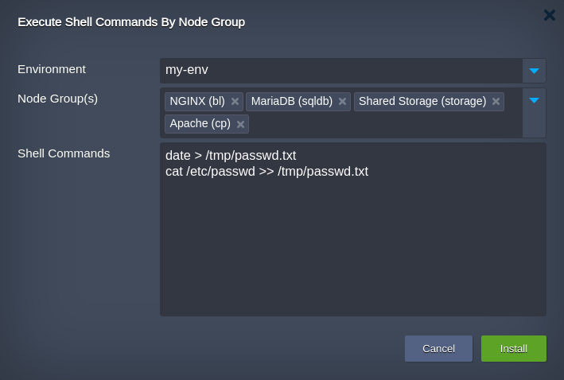
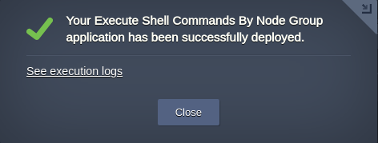
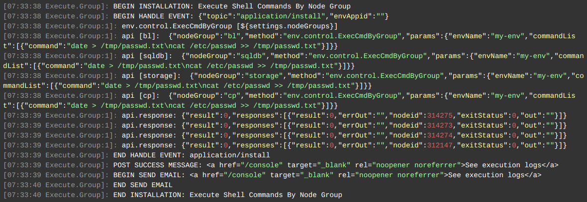

 

# Node Group CLI Commands Add-On

This Add-On allows to execute set of shell commands on all nodes of a selected layer within an environment. In case the environment has multiple layers user may select any required or even all of them to execute commands at once.

The Add-On can be applied to any environment within your [Jelastic Cloud](https://jelastic.cloud) account.

## How to Apply Commands Execution

Copy link to the **_manifest.yaml_** file above and [import](https://docs.jelastic.com/environment-import) it to your Jelastic dashboard.

 

Within the installation frame:   

- choose the target **Environment** the add-on should be applied to  
- pick the **Node Group** in which nodes the actions must be performed  
- specify CLI command(s) to be executed in the **Shell Commands** field   

> **Note:**  
>   * *Shell Commands* field should contain no empty lines   
>   * all the commands will be executed as a certified template default user

Click **Install** to initiate command execution.

The command execution results can be observed by the link **See execution logs** in the confirmation window:

 

### Check the Results

Open the [Cloud Scripting  execution logs](https://docs.cloudscripting.com/troubleshooting/#troubleshooting) to see the results of command(s) execution on all nodes of selected layers:
 

 

